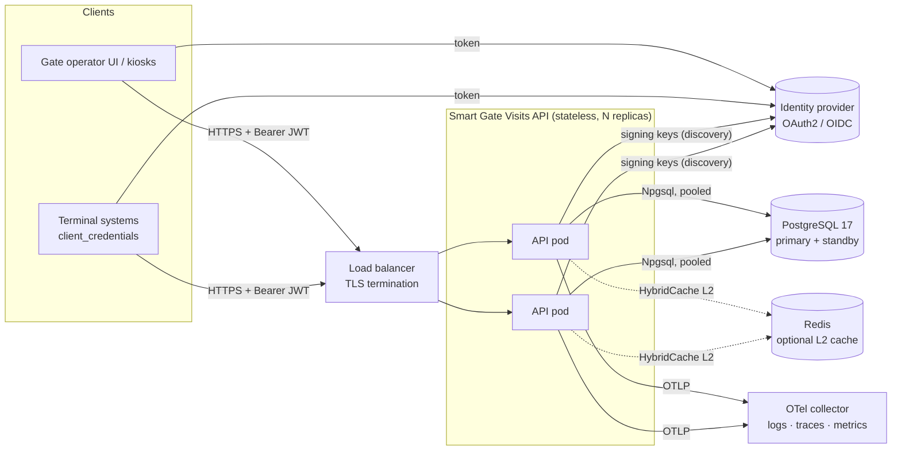
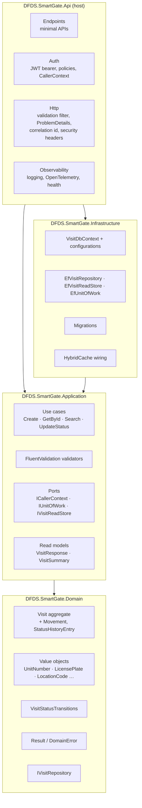
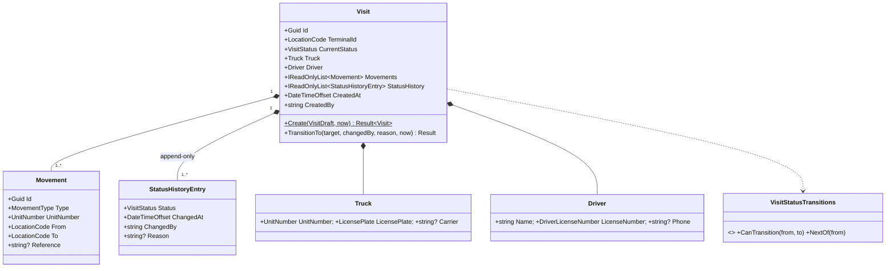
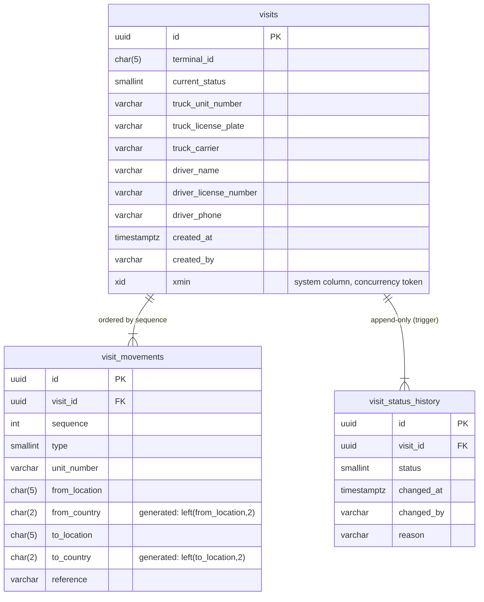

# Architecture

Truck Visit Management API for the DFDS "Smart Gate" solution. This document describes what was built and why;
decisions on ambiguous requirements and the alternatives that were rejected are in
[assumptions-and-trade-offs.md](assumptions-and-trade-offs.md).

1. [Context and drivers](#1-context-and-drivers)
2. [High-level architecture](#2-high-level-architecture)
3. [Logical components and module boundaries](#3-logical-components-and-module-boundaries)
4. [API design](#4-api-design)
5. [Domain model](#5-domain-model)
6. [Data storage rationale](#6-data-storage-rationale)
7. [Security model](#7-security-model)
8. [Observability](#8-observability)
9. [Performance, scalability and availability](#9-performance-scalability-and-availability)
10. [Test strategy](#10-test-strategy)
11. [Operations: containers, Kubernetes, AWS](#11-operations-containers-kubernetes-aws)

## 1. Context and drivers

Gate operators pre-register truck visits, track them through the terminal and search them; auditors need an
immutable history of every status change. The requirements that shaped the design:

| Driver | Consequence in the design |
|---|---|
| Near real-time status visibility | Status changes are synchronous writes; reads of a single visit are cached briefly (30 s in-process) and evicted on change, search is never cached. |
| Regulatory audits, 7-year retention | Append-only `visit_status_history` enforced by a database trigger; no delete path anywhere; retention by partition archiving (§6.5). |
| Multi-terminal expansion | Terminal is a first-class attribute (`terminal_id` UN/LOCODE) on every visit and in every index; authorisation is per terminal from the token; no per-terminal code paths. |
| 20 000 visits/day, 300 req/s peaks | Stateless API, pooled `DbContext`, every search filter index-backed, projections for reads, two-query paging (§9). |
| 99.95 % availability | Horizontally scalable stateless replicas, transient-fault retries, liveness/readiness probes, managed PostgreSQL with failover (§9, §11). |
| Security requirements | OAuth2/JWT bearer, terminal-scoped authorisation, TLS/HSTS, validation at the edge, security headers, secrets outside source control (§7). |

## 2. High-level architecture



- The API is a single deployable (`DFDS.SmartGate.Api`) with no in-memory state that matters across requests, so it
  scales by adding replicas. The only shared state is PostgreSQL (and, optionally, Redis for cache coherence).
- Authentication is delegated to an OAuth2/OIDC identity provider; the API only validates tokens (signature, issuer,
  audience, lifetime) and reads claims. Locally, `dotnet user-jwts` plays the identity provider.
- Telemetry leaves through OpenTelemetry (OTLP) so the observability backend is a deployment choice (CloudWatch via
  ADOT, Grafana, Datadog, …), not a code dependency.

## 3. Logical components and module boundaries

Clean Architecture with the dependency rule pointing inwards. Each ring is a project; the compiler enforces the
boundaries (a project cannot reference a ring outside it).



| Project | Responsibility | Depends on | Extension point |
|---|---|---|---|
| **Domain** | Business rules: the `Visit` aggregate and its invariants, value objects with normalisation/format rules, the status transition table, `Result`/`DomainError`. No NuGet packages. | – | Add a status = enum member + one row in `VisitStatusTransitions`. New identifier format = one value object. |
| **Application** | One folder per use case (`Visits/Create`, `GetById`, `Search`, `UpdateStatus`), each with a command/query, a validator and a handler. Defines the *ports* the outside must provide and the read models. Terminal authorisation rules live here. | Domain; abstraction packages only (FluentValidation, `HybridCache`, logging abstractions) | New use case = command + validator + handler; DI registration is by assembly scan. Cross-cutting behaviour = decorator over `ICommandHandler<,>` / `IQueryHandler<,>`. |
| **Infrastructure** | EF Core + PostgreSQL implementations of the ports, migrations, cache and health-check wiring. | Application | Swap the store = re-implement three ports in `AddInfrastructure`. Redis L2 = a connection string. |
| **Api** | HTTP concerns only: routing, binding, JWT validation, ProblemDetails mapping, headers, logging/telemetry. Contains no business decisions. | Application, Infrastructure | New endpoint = one `Map*` line. Claim layout of a new identity provider = `CallerClaims`. |
| **UnitTests** | Domain, Application and the Api's pure host glue, without a server or database. | Domain, Application, Api | |
| **IntegrationTests** | The real host against PostgreSQL. | Api | |

Key conventions:

- **Validate at the edge, once.** Every request has a FluentValidation validator that runs in an endpoint filter
  before the handler. Format rules are not duplicated: validators delegate to the value-object factories
  (`LicensePlate.Create` …), so a rule exists in exactly one place. Handlers receive valid input and never re-check it.
- **Expected failures are values, not exceptions.** Domain and handlers return `Result`/`Result<T>` with a
  `DomainError(Code, Message, Kind)`; the Api maps `Kind` to 400/403/404/409. Exceptions are reserved for programming
  errors (guard clauses) and framework failures.
- **No mediator.** Handlers are plain classes behind two generic interfaces; a request goes endpoint → filter →
  handler → port. There is nothing hidden between those steps.

Request flow for a status change:

```mermaid
sequenceDiagram
    participant C as Client
    participant M as Middleware<br/>(correlation, headers, logging, auth)
    participant E as Endpoint + filters
    participant H as UpdateVisitStatusHandler
    participant R as IVisitRepository / IUnitOfWork
    participant DB as PostgreSQL
    C->>M: POST /api/visits/{id}/status {status, reason}
    M->>M: validate JWT, build ICallerContext (sub, terminals)
    M->>E: route
    E->>E: merge route id into command, run validator (400 on failure)
    E->>H: HandleAsync(command)
    H->>R: GetByIdAsync(id) (tracked, split query)
    R->>DB: SELECT visit, movements, history
    H->>H: 404 if missing or terminal ∉ caller.Terminals<br/>visit.TransitionTo(target, sub, reason, now) → 409 if not allowed
    H->>R: SaveChangesAsync()
    R->>DB: UPDATE visits … WHERE id=@id AND xmin=@xmin; INSERT visit_status_history
    R-->>H: Result (409 Visit.ConcurrentUpdate on xmin mismatch)
    H->>H: evict cache "visit:{id}", audit log event
    H-->>E: Result<VisitResponse>
    E-->>C: 200 VisitResponse | ProblemDetails
```

## 4. API design

### 4.1 Conventions

- Resource-oriented minimal APIs under `/api/visits`; JSON with camelCase names; enums as names
  (`"currentStatus": "AtGate"`), case-insensitive on input; timestamps ISO-8601 UTC (`DateTimeOffset`).
- Ids are server-generated **UUID v7** (time-ordered → index-friendly inserts, still unguessable). Clients cannot
  supply `id`, `createdBy` or `currentStatus`: unknown JSON members are rejected (`400`), which also blocks mass
  assignment.
- Every error is RFC 9457 `application/problem+json`. Domain errors carry a stable machine-readable `code`
  (`Visit.NotFound`, `Visit.InvalidTransition`, `Terminal.AccessDenied` …) so clients branch on codes, not text;
  validation errors carry `errors` keyed by JSON path (`truck.unitNumber`, `movements[0].location`). All problems
  include `correlationId`. Framework-level failures (malformed JSON, wrong types) are mapped to the same shape with
  a client-safe `detail` (JSON path only – never type names, stack traces or the offending payload).
- `X-Correlation-ID`: honoured when the client sends a well-formed value (≤ 64 chars, `[A-Za-z0-9._:-]`),
  otherwise generated from the W3C trace id; always echoed.
- Versioning: none in v1 (single consumer, additive changes are backward compatible). When a breaking change is
  needed the plan is a `/api/v2/visits` route group; the handlers are versioned by adding new commands, not by
  branching inside existing ones.

### 4.2 Endpoints

All visit endpoints require a bearer token (`401`) that identifies the caller (`sub` or `client_id`, else `403`).

#### `POST /api/visits` – pre-register a visit

```json
{
  "terminalId": "DKCPH",
  "truck":  { "unitNumber": "tr 001", "licensePlate": "ab 12 345", "carrier": "ACME Haulage" },
  "driver": { "name": "Ada Lovelace", "licenseNumber": "dl 1234", "phone": "+4512345678" },
  "movements": [
    { "type": "Delivery",   "unitNumber": "cont 1", "location": "SEGOT", "reference": "BK-1" },
    { "type": "Collection", "unitNumber": "cont 2", "location": "NLRTM" }
  ]
}
```

| Field | Rules |
|---|---|
| `terminalId` | UN/LOCODE (`^[A-Z]{2}[A-Z2-9]{3}$` after trim/upper-case). Must be one of the caller's terminals → otherwise `403 Terminal.AccessDenied`. |
| `truck.unitNumber`, `truck.licensePlate`, `driver.licenseNumber` | Required. **Normalised**: all Unicode whitespace removed, NFKC, upper-case invariant; letters, digits and `-` only; max 20/20/32 chars. `"ab 12 345"` → `"AB12345"`. |
| `truck.carrier` | Optional, ≤ 200. |
| `driver.name` | Required, ≤ 200. `driver.phone` optional, E.164. |
| `movements[]` | ≥ 1. `type` ∈ `Delivery` \| `Collection`; `unitNumber` normalised like the plate; `location` = UN/LOCODE of the *external* side (origin of a delivery, destination of a collection) and must differ from `terminalId`; `reference` optional ≤ 64. |

`201 Created`, `Location: /api/visits/{id}`, body = the full visit (below). The visit starts in `PreRegistered`
with one history row; `createdBy` = token subject.

#### `GET /api/visits/{id}` – full visit with history

```json
{
  "id": "01a0c88b-560d-7092-a84e-0fc37eec8732",
  "terminalId": "DKCPH",
  "currentStatus": "AtGate",
  "truck":  { "unitNumber": "TR001", "licensePlate": "AB12345", "carrier": "ACME Haulage" },
  "driver": { "name": "Ada Lovelace", "licenseNumber": "DL1234", "phone": "+4512345678" },
  "movements": [
    { "id": "…", "type": "Delivery",   "unitNumber": "CONT1", "from": "SEGOT", "to": "DKCPH", "reference": "BK-1" },
    { "id": "…", "type": "Collection", "unitNumber": "CONT2", "from": "DKCPH", "to": "NLRTM", "reference": null }
  ],
  "statusHistory": [
    { "status": "PreRegistered", "changedTime": "2026-09-22T09:41:12.1234560+00:00", "changedBy": "gate-operator", "reason": null },
    { "status": "AtGate",        "changedTime": "2026-09-22T09:43:05.0012340+00:00", "changedBy": "gate-operator", "reason": "Arrived at gate 3" }
  ],
  "createdTime": "2026-09-22T09:41:12.1234560+00:00",
  "createdBy": "gate-operator"
}
```

`404 Visit.NotFound` for an unknown id **and** for a visit of a terminal the caller is not entitled to – the two
cases are indistinguishable so existence never leaks across terminals (see §7.2).

#### `POST /api/visits/{id}/status` – advance the status

Body `{ "status": "AtGate", "reason": "Arrived at gate 3" }` (`reason` optional, ≤ 500). Returns `200` with the
updated visit including the appended history entry (saves the client a follow-up `GET`).

Status values on the wire are the brief's statuses as stable identifiers (accepted in any casing):

| Brief | API value | Meaning |
|---|---|---|
| Pre-Registered | `PreRegistered` | visit announced, truck not yet arrived (initial status of every visit) |
| At Gate | `AtGate` | truck arrived at the gate |
| On Site | `OnSite` | truck admitted to the terminal |
| Completed | `Completed` | truck left; terminal status |

The flow is strictly forward: `PreRegistered → AtGate → OnSite → Completed`. Anything else – skipping a step,
moving backwards, repeating the current status, leaving `Completed` – is `409 Visit.InvalidTransition` /
`Visit.AlreadyInStatus`, with the allowed next status named in `detail`. A lost optimistic-concurrency race is
`409 Visit.ConcurrentUpdate` (reload and retry). Unknown status names are `400`. There is no `PUT`: truck, driver
and movements are immutable after creation (an audit-relevant record is corrected by creating a new visit).

#### `GET /api/visits` – search

| Parameter | Semantics |
|---|---|
| `terminalId` | One of the caller's terminals (`403` otherwise). **Omitted → all of the caller's terminals.** |
| `currentStatus` | Status name, any casing. |
| `movementFrom`, `movementTo` | A 2-letter country code **or** a 5-character UN/LOCODE, matched against a movement's origin / destination (a delivery's `from` is the external location, its `to` the terminal; a collection is the reverse). A visit matches when **at least one movement** satisfies the given filter(s); when both are given they must hold for the **same** movement. |
| `createdTimeFrom`, `createdTimeTo` | Inclusive UTC bounds. **Omitted → the last 30 days**, and the effective window is echoed in the response. `from > to` is `400`. |
| `createdBy` | Exact match on the creator's token subject. |
| `page`, `pageSize` | 1-based; defaults 1 / 20; `pageSize` ≤ 100. |

Ordering is fixed: `createdTime desc, id desc` (newest first, deterministic). Response:

```json
{
  "items": [ { "id": "…", "terminalId": "DKCPH", "currentStatus": "AtGate", "truck": { … }, "driverName": "Ada Lovelace",
               "movements": [ … ], "createdTime": "…", "createdBy": "gate-operator" } ],
  "page": 1, "pageSize": 20, "totalCount": 1, "totalPages": 1,
  "createdTimeFrom": "2026-08-23T09:50:00+00:00", "createdTimeTo": "2026-09-22T09:50:00+00:00"
}
```

Items are summaries (no `statusHistory`, driver reduced to the name) to keep list payloads small; the full record is
one `GET` away.

#### Health

`GET /health/live` (process answers) and `GET /health/ready` (PostgreSQL reachable) – anonymous, return a bare
status word, never check details.

## 5. Domain model



- `Visit` is the aggregate root and the only mutable object; its two operations `Create` and `TransitionTo` are the
  only ways state changes, and both return `Result` rather than throwing on business-rule violations.
- **Value objects** (`readonly record struct` with a `Create(raw) → Result<T>` factory) own the format rules:
  `UnitNumber`, `LicensePlate`, `DriverLicenseNumber` (shared `IdentifierNormalizer`), `LocationCode` (UN/LOCODE,
  derives its `CountryCode`), `LocationFilter` (country-or-location search filter). Once constructed they are valid by
  construction, so the rest of the code never checks formats.
- **Status transitions are data** (`FrozenDictionary<VisitStatus, VisitStatus>` "allowed next"), not `if` chains: a
  future `AtGate → Rejected` is a new enum member and a table row, covered by the same tests.
- Movement direction is derived: the client gives one `location`; a `Delivery` is `location → terminal`, a
  `Collection` is `terminal → location`. Invalid `from/to` combinations therefore cannot be expressed.
- The status history always starts with the `PreRegistered` entry written at creation, so it is never empty and the
  creation itself is part of the audit trail.

## 6. Data storage rationale

### 6.1 Why PostgreSQL, and why relational tables

The workload is small in volume (20 000 visits/day ≈ 0.25 writes/s average, ~50 M visits over 7 years) but has
**many indexed access paths**: every search parameter must be served by an index at 300 req/s, two of them
(`movementFrom/To`) filter on child rows, and reads by id must include ordered children. A relational store with
proper indexes is the simplest thing that meets this, and PostgreSQL adds what the audit requirements need: row-level
triggers (immutability), generated columns, system columns for optimistic concurrency (`xmin`), and declarative
partitioning for retention. It is also boringly operable as a managed service (RDS/Aurora, multi-AZ).

Alternatives considered: a document per visit (JSONB column or DynamoDB/Cosmos) keeps movement order for free and
matches the response shape, but indexing `movements[*].from` for country- and location-level search needs GIN
expression indexes or denormalised lookup tables and gives up the append-only trigger and `xmin`; event sourcing
matches "immutable history" perfectly but adds projections and rebuild tooling for a domain whose history is just
four rows per visit. Both are noted in the trade-offs document.

### 6.2 Schema



- **Truck and driver are columns on `visits`** (EF complex properties), not separate tables: there is no requirement
  to deduplicate trucks or drivers across visits, a visit is a snapshot of who came with what, and keeping PII in one
  table simplifies retention and access control.
- **`from_country` / `to_country` are stored generated columns** (`left(location, 2)`), so the country-level search is
  a plain B-tree lookup and the value can never drift from the location it is derived from.
- **`sequence`** preserves request order of movements (UUID v7 ids created in the same millisecond do not sort by
  request order).
- Enums are stored as `smallint`; identifiers as their normalised text (the normalisation happens once, on input).

### 6.3 Indexes (every search path is covered)

| Index | Serves |
|---|---|
| `ix_visits_terminal_created (terminal_id, created_at desc, id desc)` | default search and its ordering / paging, time window |
| `ix_visits_terminal_status_created (terminal_id, current_status, created_at desc)` | `currentStatus` filter |
| `ix_visits_terminal_created_by_created (terminal_id, created_by, created_at desc)` | `createdBy` filter |
| `ix_visit_movements_{from,to}_{location,country}` (4 single-column) | `movementFrom` / `movementTo` as `EXISTS` sub-queries |
| `ix_visit_movements_visit_sequence (visit_id, sequence)` unique | ordered child load, uniqueness of order |
| `ix_visit_status_history_visit_changed_at (visit_id, changed_at)` | ordered history load |

The terminal is the leading column everywhere because every query is terminal-scoped by authorisation; this is also
what keeps multi-terminal growth from degrading any single terminal's queries.

### 6.4 Integrity and concurrency

- **Append-only audit trail at the database**: trigger `trg_visit_status_history_append_only` raises SQLSTATE 23000
  on any `UPDATE` or `DELETE`, so even a privileged connection or a future bug cannot rewrite history. The aggregate
  is append-only too; the trigger is defence in depth.
- **Optimistic concurrency** on `visits` via the `xmin` system column: a status update is
  `UPDATE … WHERE id = @id AND xmin = @xmin`; a lost race surfaces as `409 Visit.ConcurrentUpdate`. No version column
  to maintain, no pessimistic locks.
- Foreign keys with the visit as the only parent; no cascading deletes because nothing deletes.

### 6.5 Retention (7 years) and growth

Nothing in the application deletes. At ~50 M visits, ~100 M movements and ~200 M history rows over seven years the
tables stay well inside single-instance PostgreSQL territory, but index maintenance and backups benefit from
bounding the hot set. The intended approach – documented, not implemented in v1 because EF migrations do not manage
partitions – is **range partitioning by `created_at` (yearly)** for all three tables (children partitioned by the
parent's key via a composite key), with partitions older than seven years **detached and archived** to object
storage (S3 Glacier) before being dropped. Queries default to a 30-day window, so partition pruning keeps the working
set to one or two partitions.

### 6.6 Access patterns

| Operation | Query shape |
|---|---|
| `GET /{id}` | one compiled projection query (visit ⨝ movements ⨝ history; the product is tiny), `AsNoTracking`, then cached |
| Search | `SELECT COUNT(*)` + page query with `EXISTS` on movements when movement filters are present; both use the terminal-leading indexes |
| Create / status update | tracked load with split queries (three PK lookups), single `SaveChanges` transaction |

Reads never load the aggregate; writes never use projections (CQRS-lite: `IVisitReadStore` vs `IVisitRepository`).

### 6.7 Schema evolution

EF Core migrations, generated with a design-time factory (no running host needed), applied by `dotnet ef database
update` from the deployment pipeline before the new version rolls out. An integration test fails when the model has
changes without a migration (`HasPendingModelChanges`).

## 7. Security model

### 7.1 Authentication – OAuth2 / JWT bearer

- Standard `JwtBearer` handler. Production configuration: `Authority` (OIDC discovery → signing keys, rotated by
  the provider), `ValidAudiences`, `RequireHttpsMetadata = true`. Inbound claim mapping is off, so the raw JWT claim
  names are used (`sub`, `client_id`, `terminal`). Clock skew tolerance is one minute.
- **Fail fast on misconfiguration**: an options validator runs at start-up and refuses to start when no authority or
  key is configured, no audience is set, or – outside Development – a symmetric key or plain-HTTP metadata is used.
  A misconfigured deployment therefore never runs "open" or answers 401 to everything silently.
- A fallback authorisation policy requires an authenticated user on **every** endpoint; only the health probes and
  the Development-only OpenAPI document opt out explicitly. Unmapped paths also answer 401 to anonymous callers.
- Locally, `dotnet user-jwts` issues symmetric-key tokens for the `Development` environment only.

### 7.2 Authorisation – terminal access

- The token carries a multi-valued `terminal` claim (UN/LOCODEs); `CallerContext` parses it fail-closed (malformed
  values are dropped) and exposes `ICallerContext { Subject, Terminals }` to the Application layer. Repeated claims
  and space/comma-delimited values are both accepted, because identity providers differ.
- The policy `VisitAccess` only demands "authenticated with a subject"; **the terminal decision is made in the
  handlers**, where the resource is known:

  | Operation | Terminal not in token |
  |---|---|
  | `POST /api/visits` | `403 Terminal.AccessDenied` (the caller named the terminal) |
  | `GET /api/visits?terminalId=` | `403 Terminal.AccessDenied` |
  | `GET /api/visits` (no terminal) | silently restricted to the caller's terminals |
  | `GET /api/visits/{id}`, `POST …/status` | **`404`**, identical to an unknown id – existence must not leak across terminals (IDOR prevention, relevant with time-ordered ids) |

- No roles in v1: a terminal claim grants read and write for that terminal. Scopes (`visits:read` / `visits:write`)
  are the planned refinement and would be an additional policy, not a handler change.
- `createdBy` / `changedBy` are always the token subject; the body cannot set them.

### 7.3 Transport

TLS terminates at the load balancer / ingress, which only forwards HTTPS traffic. The API emits HSTS outside
Development and redirects plain HTTP to HTTPS when it knows its HTTPS port (`ASPNETCORE_HTTPS_PORT`; behind an
ingress this is a belt-and-braces measure). `ASPNETCORE_FORWARDEDHEADERS_ENABLED=true` makes the original scheme
visible to both. Kestrel sends no `Server` header.

### 7.4 Input validation and hardening

- FluentValidation at the edge for every request; format rules come from the value objects (one source of truth).
- Unknown JSON members are rejected (no mass assignment of `id`, `createdBy`, `currentStatus`); route/body id
  mismatch is impossible because the route id overwrites the body before validation.
- Request bodies are capped at 64 KB (a create with a handful of movements is < 10 KB); larger bodies are `413`.
- Enum binding is by name; numeric query values for statuses are rejected; UN/LOCODE and identifier lengths are
  bounded, so no unbounded strings reach the database.
- Error responses never include stack traces, type names or the submitted payload.

### 7.5 Security headers

Every response (including errors): `Strict-Transport-Security`, `X-Content-Type-Options: nosniff`,
`X-Frame-Options: DENY`, `Content-Security-Policy: default-src 'none'; frame-ancestors 'none'`,
`Referrer-Policy: no-referrer`, `Permissions-Policy`, `Cache-Control: no-store` (responses contain personal data).

### 7.6 Secrets and personal data

- No secret in the repository: connection strings and IdP settings come from user-secrets locally and from
  environment variables / a secret manager (Kubernetes Secrets, AWS Secrets Manager) in deployments.
- Driver name, licence number and phone are personal data: they are never written to logs or telemetry (request
  logging excludes bodies and headers, the audit log events carry ids and subjects only), responses are `no-store`,
  and retention is bounded by the partition archiving plan. Field-level encryption and a documented legal basis for
  the 7-year retention are listed as follow-ups.

### 7.7 Audit logging

Two complementary records of every status change: the immutable `visit_status_history` row (who, when, from/to,
reason – the source of truth auditors query) and a structured log event (`VisitAuditLog`, event ids 1001/1002) with
visit id, terminal, statuses and subject – no personal data – for operational forensics and alerting.

## 8. Observability

| Requirement | Implementation |
|---|---|
| Structured logging | JSON console logs outside Development (scopes included), `LoggerMessage` source-generated events, no string interpolation. One combined `HttpLogging` line per request (method, path, status, duration; never headers or bodies). |
| Correlation ids | `CorrelationIdMiddleware`: accept a well-formed client `X-Correlation-ID` or derive from the W3C trace id; pushed as a logging scope so every line of the request carries it; echoed in the response header and in every ProblemDetails. |
| Throughput / latency metrics | OpenTelemetry metrics: ASP.NET Core request duration histogram (per route and status), runtime (GC, thread pool), Npgsql connection pool, EF Core. |
| Traces | OpenTelemetry tracing for ASP.NET Core and Npgsql (health probes excluded to reduce noise). |
| Export | OTLP when `OTEL_EXPORTER_OTLP_ENDPOINT` is set – vendor neutral; otherwise in-process only. |
| Health | `/health/live` (no checks; restarts a hung process) and `/health/ready` (PostgreSQL check tagged `ready`; takes an instance out of rotation without restarting it). |
| Audit | §7.7. |

**Error tracking strategy.** Expected failures are `Result`s and produce 4xx ProblemDetails with a `code`; they are
not exceptions and not errors in the logs (they are visible as status-code metrics). Unexpected exceptions reach the
exception handler middleware, which returns a generic `500` ProblemDetails with the correlation id and logs the
exception once, with the correlation and trace ids; the OTLP pipeline forwards these to the error tracker (e.g.
Sentry/CloudWatch alarms on `5xx` rate and on the `Microsoft.AspNetCore.Diagnostics.ExceptionHandlerMiddleware`
category). Operators triage from correlation id → log scope → trace. Alert candidates: `5xx` rate, p99 latency per
route, readiness failures, `409 Visit.ConcurrentUpdate` rate (contention), authentication failure spikes.

## 9. Performance, scalability and availability

**Targets:** 20 000 visits/day, 300 req/s peaks, 99.95 % availability.

- **Capacity.** Writes are trivial (≈ 0.25/s average, a few per second at the gate rush). Peaks are reads: search and
  get-by-id. Each is one or two index-backed queries returning ≤ 100 rows; at 300 req/s a single PostgreSQL instance
  is far from saturated, and the API tier scales horizontally because it is stateless.
- **Hot paths avoid waste.** Compiled query for get-by-id; projections (`AsNoTracking`) for all reads; no N+1 (split
  query for the aggregate load, `EXISTS` for movement filters); `DbContext` pooling; `HybridCache` for get-by-id with
  in-process L1 (30 s) and optional Redis L2 (5 min), evicted on status change; response DTOs are immutable so L1
  hits return the cached instance without deserialising.
- **Search paging** is offset-based with a separate `COUNT(*)` (required to return `totalPages`); with the 30-day
  default window and terminal-leading indexes the count is cheap. Keyset paging is the planned upgrade if deep pages
  ever matter.
- **Resilience.** Npgsql/EF retry on transient failures (3 attempts, up to 2 s back-off) covers connection blips and
  failovers; optimistic concurrency avoids lock waits; request body limits and bounded page sizes prevent
  amplification.
- **Availability (99.95 % ≈ 4.4 h/year).** Stateless replicas behind a load balancer with readiness probes (a
  degraded instance stops receiving traffic; a hung one is restarted by liveness); rolling deployments; managed
  PostgreSQL with synchronous standby and automatic failover; migrations applied before rollout and kept
  backward-compatible with the previous version.
- **Multi-terminal expansion.** Nothing is per terminal except data and claims. Adding a terminal is a claim in the
  identity provider; the terminal-leading indexes keep query cost independent of the number of terminals; if one
  terminal ever needed isolation, the same schema can be partitioned or sharded by `terminal_id` without code change.

### 9.1 Load test results

`tests/load/k6/visits.js` drives a realistic mix – 60 % search (nine filter variants), 30 % get-by-id, 6 % create,
4 % status update – at a **fixed arrival rate** (`ramping-arrival-rate`, one request per iteration), with pass/fail
thresholds: error rate < 1 %, p95 < 200 ms, p99 < 500 ms. Profile: ramp to 300 req/s in 30 s, hold 300 req/s for
2 min, ramp to 450 req/s and hold 30 s (headroom). Measured on a development laptop (Apple M3 Max, 16 cores, API in
Release, local PostgreSQL 17, ~8 000 visits in the database, request logging on):

| Metric | Result |
|---|---|
| Requests | 66 200 in 3 min 30 s, **0 failed**, 0 dropped iterations |
| Latency, all requests | avg 3.2 ms · median 2.6 ms · **p95 8.2 ms** · p99 10.7 ms · max 222 ms |
| `GET /api/visits` (search) | p95 8.9 ms · p99 11.5 ms |
| `GET /api/visits/{id}` | p95 1.7 ms · p99 2.7 ms (cache hits) |
| `POST /api/visits` | p95 3.7 ms · p99 5.9 ms |
| `POST …/status` | p95 5.0 ms · p99 8.8 ms |
| Concurrency needed | at most 5 virtual users in flight at 450 req/s |

The full run is recorded in [`load-test/`](load-test/): `report.html` (k6's exported web dashboard – request rate,
latency percentiles and errors over time, per stage; open it in a browser), `summary.json` (raw metrics) and
`summary.txt` (console output with the threshold results). Anyone can reproduce it with the commands in the README
and compare.

The target is met with a margin of ~25× on p95; the 450 req/s stage shows no degradation, so the design has headroom
for the peak requirement on modest hardware. These are single-node laptop numbers – network hops, TLS termination
and a managed database add latency in production, but not the kind that closes a 25× gap. The same script runs in
CI on demand (`.github/workflows/load-test.yml`, 300 req/s for 60 s on a shared runner with relaxed thresholds).

## 10. Test strategy

| Level | What | How | Count |
|---|---|---|---|
| Unit – Domain | normalisation rules (the brief's explicit business rule, incl. Unicode cases), value-object formats, every allowed/forbidden status transition, aggregate invariants | plain xunit.v3, no mocks needed | |
| Unit – Application | each handler's outcomes (success, 403/404 rules, cache use, audit events), each validator's rules, DI registration | in-memory fakes of the ports, `FakeTimeProvider` | 225 total |
| Unit – Api glue | claims → caller context (repeated/delimited/malformed claims), ProblemDetails mapping, validation filter and JSON-path keys, correlation id rules, bearer options validator | no server | |
| Integration | the real host and pipeline against PostgreSQL (Testcontainers): JWT 401/403 paths under production rules (RSA keys, HSTS), security headers and correlation ids, all endpoints and search filters, terminal scoping, migration completeness, append-only trigger, `xmin` concurrency | `WebApplicationFactory<Program>` + `postgres:17-alpine`, one host per run, isolation by a random terminal per test | 63 |

| Load | the request mix at 300–450 req/s with latency and error thresholds (§9.1) | k6, `tests/load/k6/visits.js`; on demand in CI | 1 scenario |

CI (`.github/workflows/ci.yml`) builds with warnings as errors, runs unit and integration tests (Testcontainers on
the runner's Docker) and builds the container image on every push and pull request; the load test is a manually
triggered workflow. Not covered by automated tests and listed as future work: contract tests once a second consumer
exists.

## 11. Operations: containers, Kubernetes, AWS

These are the optional topics of the brief; the artefacts are samples, not a deployment.

### 11.1 Container image

[`Dockerfile`](../Dockerfile): multi-stage build (SDK image restores and publishes, runtime image is
`aspnet:10.0-noble-chiseled-extra` – distroless-style, non-root, and the `-extra` variant ships ICU, which the
identifier normalisation needs). The image contains no secrets; configuration is injected as environment variables.

```bash
podman build -t smartgate-api .
podman run --rm -p 8080:8080 \
  -e ConnectionStrings__Visits="Host=host.containers.internal;Database=dfds_visits_dev;Username=postgres;Password=postgres" \
  -e Authentication__Schemes__Bearer__Authority="https://idp.example.com/realms/dfds" \
  -e Authentication__Schemes__Bearer__ValidAudiences__0="smartgate-api" \
  smartgate-api
```

### 11.2 Kubernetes

[`deploy/k8s/smartgate-api.yaml`](../deploy/k8s/smartgate-api.yaml): a `Deployment` (3 replicas, rolling update,
liveness → `/health/live`, readiness → `/health/ready`, resource requests/limits, non-root security context,
read-only root filesystem), a `Service`, a `PodDisruptionBudget`, a `HorizontalPodAutoscaler` on CPU and request
rate, and a `Secret`/`ConfigMap` split (connection string and IdP settings as secrets, OTLP endpoint and forwarded
headers as config). Migrations run as a pre-deploy `Job` (`dotnet ef database update` from the SDK image, or a
migration bundle) so the schema is ready before the new pods pass readiness.

### 11.3 AWS mapping

| Concern | Service |
|---|---|
| Compute | EKS (the manifest above) or ECS Fargate; ALB with ACM certificate terminates TLS |
| Database | RDS for PostgreSQL 17, Multi-AZ, automated backups (35 days) + snapshots exported to S3 for the 7-year audit retention; archived partitions to S3 Glacier |
| Cache | ElastiCache for Redis as the `HybridCache` L2 when running more than one replica |
| Secrets | Secrets Manager / Parameter Store injected as environment variables (External Secrets Operator on EKS) |
| Identity | Cognito or the corporate IdP (Entra ID) as the OIDC authority |
| Observability | ADOT collector receives OTLP → CloudWatch Logs (JSON logs, Logs Insights on `CorrelationId`), CloudWatch Metrics (latency/throughput alarms), X-Ray traces |
